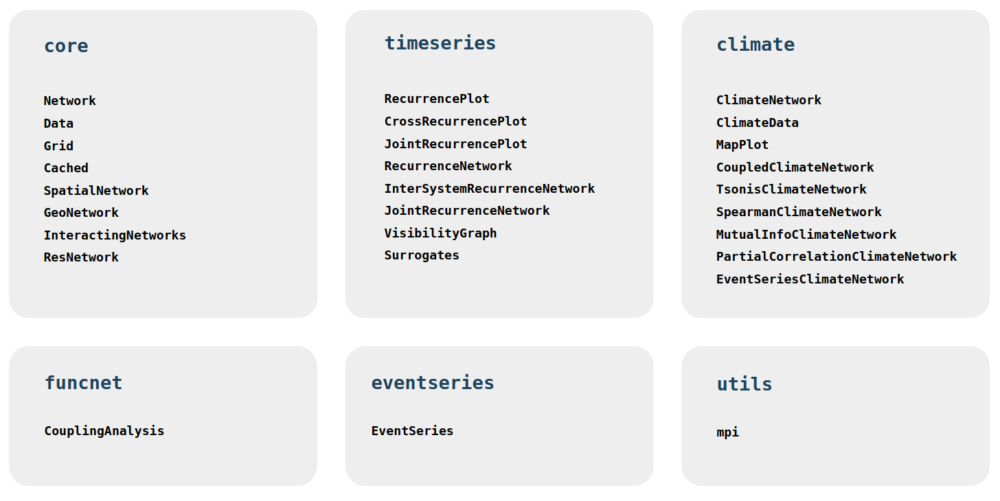

# Summary

Pyunicorn is a toolbox for complex systems analysis that is written in Python and C. The package contains implementations of highly specialised methods that derive from the synthesis of network theory and timeseries analysis, but can also serve as a general-purpose tool for the construction of complex networks. Pyunicorn is fast, as computationally expensive functions are written in C or precompiled via [Cython](https://cython.org). It can easily be parallelized on large cluster architectures with the built-in MPI helper.

The package was first published with @donges_unified_2015 and has since been maintained as an open source project. After more than a decade of consistent feature contributions but fluctuating availability of maintenance resources, we have recently coordinated efforts to enable a series of minor version releases. This publication accompanies Pyunicorn's first major version release (cf. [semver.org](https://semver.org)), an overdue step reflecting Pyunicorn's establishment as open source scientific software. Pyunicorn v1.0 features a range of additional functionality and includes years of maintenance work making the package more versatile and robust.

Highly specialised scientific software is published more and more frequently. Not least, we aim to put some counterweight on the integrated development and long-term maintenance of such projects despite them naturally growing more complex over time. This ambition of ours is of course spurred by the steadily rising number of scientific publications that have employed Pyunicorn to date. 

# Statement of need

Potential research purposes of Pyunicorn have been laid out in @donges_unified_2015. The publications referenced in section \ref{research_impact_statement} showcase further interesting applications. At this point, the question of need may more sensibly be pointed not to the package per-se, but rather to its re-issue herewith.

There are two key motivations for this. Firstly, Pyunicorn proves the value of developing and maintaining a highly specialised codebase over a long time. Secondly, the work we recently invested in the project and that ultimately lead to the release of version 1.0 justifies an update to the original publication.

Pyunicorn has continuously grown over the years as scientists and other users took the chance to contribute. These contributions have originated both from within and outside the direct proximity of the initial developers. Maintenance work on the project was largely provided by early career scientists, often master students supervised by J. Donges, B. Beronov and R. Donner. With a growing codebase and fluctuating levels of funding and expertise available, it has proven challenging to maintain the package to a solid standard over time. Over the last 3 years, we were able to coordinate as a small group combining the needed expertise and working-hours to tackle a significant maintenance backlog. A row of minor version releases have since been issued which contain additional features and worthwile adaptations. Eventually, this brought us to the realization that the release of version 1.0.0 was overdue. Pyunicorn may serve as an example for the feasability of the long-term maintenance of open-source scientific software under the typical fluctuations of available resources.

More importantly though, as sections \ref{software_design} and \ref{research_impact_statement} set out, Pyunicorn is now a more versatile and robust tool than ever and therefore deserves the attention of this re-issue alongside its first major version release.

# State of the field

Pyunicorn, is designed to unify methods from complex network theory and timeseries analysis under a single hood and – more importantly – derives further specialised and more uncommon methods from this synthesis. Many of these derived methods have been established by affiliated research groups themselves. Pyunicorn currently provides their only actively maintained and publicly available implementation.

There is a row of existing Python libraries that cover different aspects of Pyunicorn's functionality respectively. [`PyRQA`](https://pypi.org/project/PyRQA/) is a more specialised tool for performing recurrence quantitative analysis that is optimized for handling large datasets [@rawald_pyrqa_2017]. 
@pessa_ordpy_2021 provide a sophisticated package for timeseries analysis with ordinal networks named [`ordpy`](https://pypi.org/project/ordpy/). Users who seek to perform surrogate timeseries generation can resort to the Surrogate Modeling Toolbox [`smt`](https://pypi.org/project/smt/). More recently, the python packages [`irreversibility`](https://pypi.org/project/irreversibility/) (for irreversibility tests of timeseries, cf. @zanin_irreversibility_2025) and [`pynamicalsys`](https://pypi.org/project/pynamicalsys/) (for dynamical systems analysis, cf. @sales_pynamicalsys_2025) have been added to the mix of related software. Moreover, long established Python libraries such as [`networkx`](https://networkx.org) and [`python-igraph`](https://python.igraph.org) extensively cover network and graph calculations.

Yet, Pyunicorn has maintained its unique position in bridging the above fields while adding to established packages. For instance, Pyunicorn's backbone `Network` class is built around `Graph` objects from `python-igraph` and expands its functionality to more uncommon/specialised variations of network theory such as interacting networks or node-splitting-invariant measures. Yet, the core strength of the package lies in seamlessly integrating network handling with timeseries analysis methods, as in recurrence network analysis or climate networks.

The contained methods have especially been developed and applied in the context of climate and earth system sciences. The generality of the network approach, however, allows for a much wider applicability. A selection of research applications of Pyunicorn is described in section \ref{research_impact_statement}.

# Software design
\label{software_design}

Pyunicorn v1.0 continues the original implementation philosophy of the package, which is to provide a common container for conceptually related methods co-developed in affiliated research groups. By adopting a modular class-inheritance structure, the mathematical relationships and historical development of methods are intuitively reflected. A simple example for this intuition is the `RecurrenceNetwork` class, which is a child of the `Network` and `RecurrencePlot` classes (see fig. 2).

{width=7cm}

The continuation of these design principles can be illustrated with more recent additions to the package. For example, the `EventSeriesClimateNetwork` inherits from the additional `EventSeries` and the established `ClimateNetwork` classes. Also, the newly added `Cached` class neatly integrates into the object-oriented package structure. As a mix-in class that is built around Python's own caching methods, it adds need-specific memoization to key classes of Pyunicorn. New functionality in the `RecurrenceNetwork` class exemplifies how the package is continuously extended to serve specific research interests: Requested by a doctoral student affiliated with our group (Simon Fahrländer) and after consultation with one of the originators of Recurrence Network theory (Jobst Heitzig), we revised the implementation of node-splitting-invariant shortest-path betweenness to enable its calculation on directed networks in a mathematically sound way. As scientific software ideally does, Pyunicorn can thus not only provide the implementation, but can also act as a catalyst for niche knowledge exchange.

For a full record of additions to the package since its original publication see our [Changelog](https://github.com/pik-copan/pyunicorn/blob/master/CHANGELOG.rst).

# Research impact statement
\label{research_impact_statement}

Pyunicorn has continuously been employed in research from a range of disciplines since its first publication.

*affiliated:*

- @donges_monsoon_2015; recurrence network analysis
- @wiedermann_elnino_2016; climate network analysis
- @franke_holocene_2017 (donner); using AAFT surrogates
- @lekscha_paleo_2020; wRNA analysis based on pyunicorn
- @wolf_baiu_2021 (donner); network construction and analysis with pyunicorn
- @wolf_itcz_2021 (donner) ; climate networks with pyunicorn
- @ekhtiari_enso_2021 (donner); coupled climate network analysis with pyunicorn
- @marwan_proxy_2021 ; RQA/RNA/VG with pyunicorn

*Pyunicorn has been enhanced e.g. with:*

- @odenweller_eventseries_2020

*indirectly affiliated:*

- @caesar_amoc_2020; using AAFT surrogates

*not affiliated:*

- @mullin_lhc_2021; nsi network measures, apparently in contact with Jobst/Jona
- @george_betelgeuse_2020; use pyunicorn recurrence-analysis for early-warning
- @silini_transferentropy_2021; calculate transfer entropy with pyunicorn, for reference to their method
- @sales_stickiness_2023: Stickiness and recurrence plots; Use pyunicorn for all recurrence matrix evaluations.
- @lechner_abnormal_2024: ; using AAFT surrogates for statistical tests
- @sumit_circulation_2026 ; ECA with pyunicorn, one of multiple methods involved

# AI usage disclosure

No generative AI was used in the writing of this manuscript. AI coding agents may have been used by Pyunicorn contributors as available at the time. AI coding agents have occasionally been used for software maintenance.

# Author contributions

FK has written the manuscript and coordinated software maintenance and release. BB, JFD and RVD have reviewed and enhanced the manuscript. BB has provided both hands-on work and expert guidance for software development and maintenance. JFD and RVD have cared for funding and supervised development. FK and JFD have coordinated the manuscript publication.

# Acknowledgements

We acknowledge all code and bug-report contributions to Pyunicorn that have been issued over the years. We are especially thankful for the code and maintenance work provided by Max Bechtold, Ronja Hotz and Jonathan Kroenke. Besides the direct coding work, we would like to thank Pyunicorn's original co-developer Jobst Heitzig for his availability for consultation.

# References